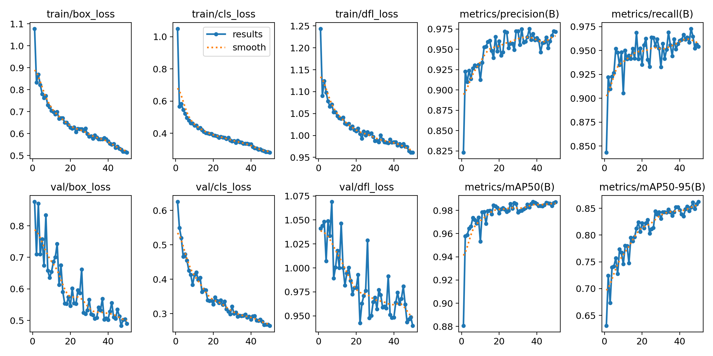
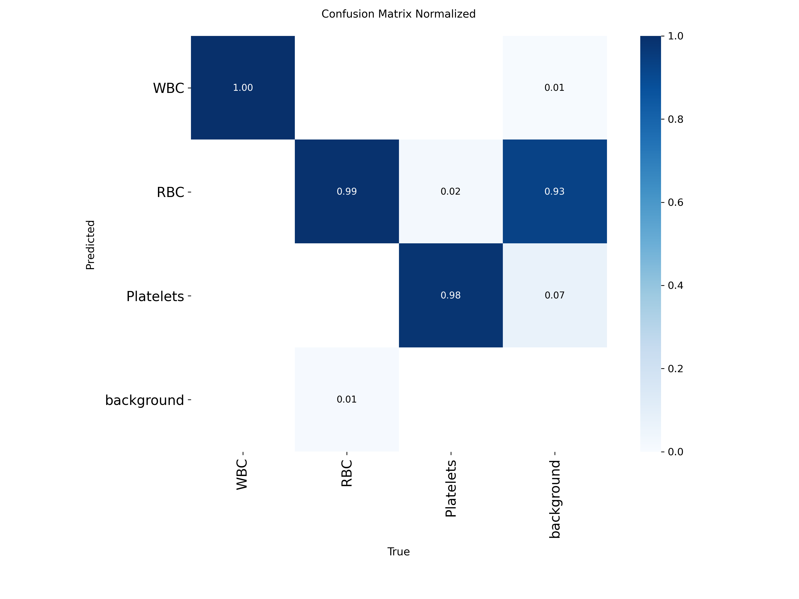

# 🩸 Blood Cell Detection with YOLOv8
> **Thesis Project** — Development of a Domain Expert using a Large Language Model  
> **Stage 1** — Vision Model for Blood Cell Detection

---

## 📊 Results

| Metric | Score |
|--------|-------|
| mAP@0.50 | 0.9849 |
| mAP@0.50:0.95 | 0.8762 |
| Precision | 0.9759 |
| Recall | 0.9606 |

### Per-Class Performance

| Class | mAP@0.50 | Notes |
|-------|----------|-------|
| WBC | 0.9950 | Perfect recall (1.000) |
| RBC | 0.9900 | Most common cell |
| Platelets | 0.9700 | Smallest cell type |

---

## 🔍 Sample Predictions


---

## 📈 Training Curves



---

## 🔲 Confusion Matrix



---

## 📉 Precision-Recall Curve


---

## 📉 F1 Curve


---

## 🏗️ Full Pipeline Architecture
```
Blood Smear Image
       ↓
[ YOLOv8s — Stage 1 ]
  detects WBC · RBC · Platelets
       ↓
[ Structured JSON Summary ]
  cell counts · ratios · flags
       ↓
[ LLM + RAG — Stage 2 ]
  clinical interpretation
  differential diagnosis
       ↓
  Final Clinical Report
```

---

## 📦 Dataset

| | |
|---|---|
| **Name** | TXL-PBC |
| **Images** | 1,260 |
| **Annotations** | 18,143 bounding boxes |
| **Classes** | WBC, RBC, Platelets |
| **Format** | YOLO (.txt labels) |
| **Source** | https://github.com/lugan113/TXL-PBC_Dataset |

---

## ⚙️ Training Configuration

| Parameter | Value |
|-----------|-------|
| Model | YOLOv8s (11.2M parameters) |
| Pretrained on | COCO (118k images) |
| Epochs | 50 (early stopping) |
| Image size | 640 x 640 |
| Batch size | 16 |
| Optimizer | AdamW |
| Learning rate | 0.001 |
| GPU | Tesla T4 |
| Training time | 0.301 hours |

---

## 🚀 How to Run Inference
```python
from ultralytics import YOLO

model = YOLO('best.pt')
results = model.predict('blood_smear.jpg', conf=0.25)
results[0].show()
```

---

## 📄 Full Report

Download [report.pdf](report.pdf) for the complete thesis report including
all figures, metrics, and next steps.

---

## 📚 References

- Jocher et al. (2023). Ultralytics YOLOv8
- TXL-PBC Dataset — https://github.com/lugan113/TXL-PBC_Dataset

---

## ⚠️ Disclaimer

Research prototype only. Not a certified medical device.
Always consult a qualified hematologist.
