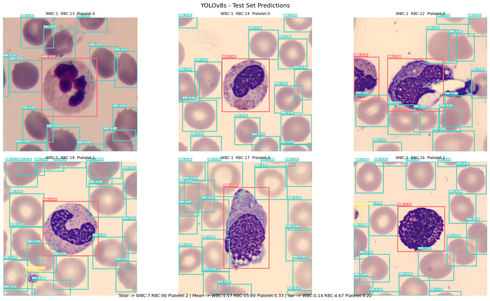
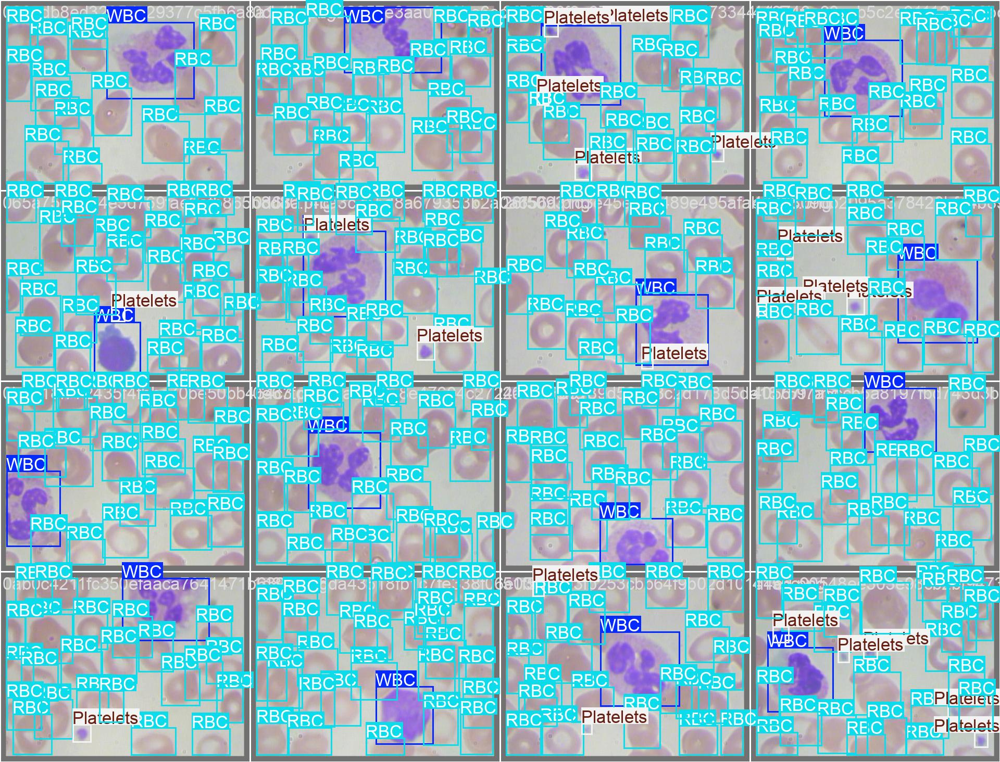
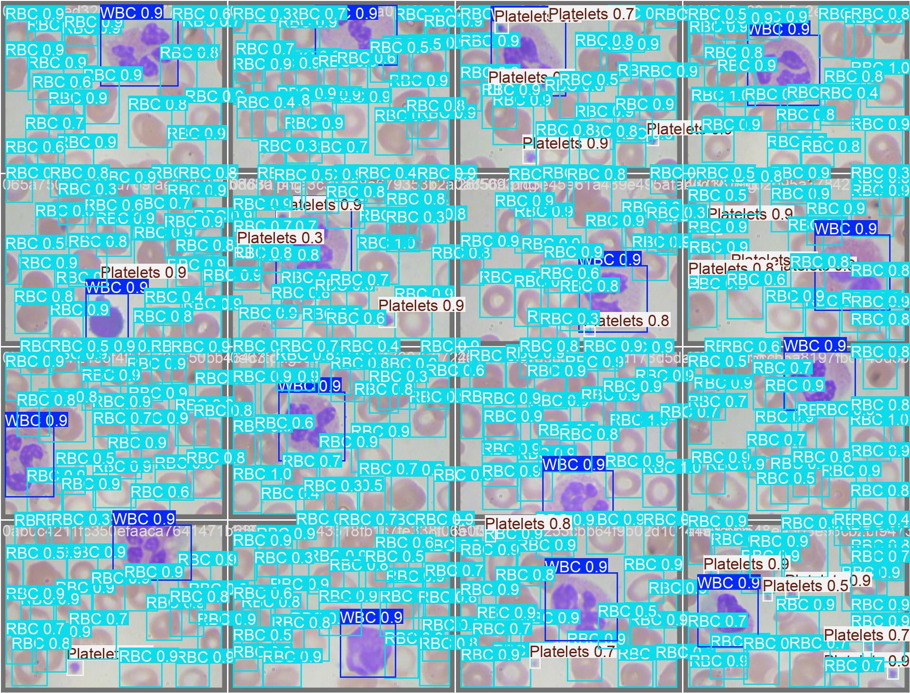
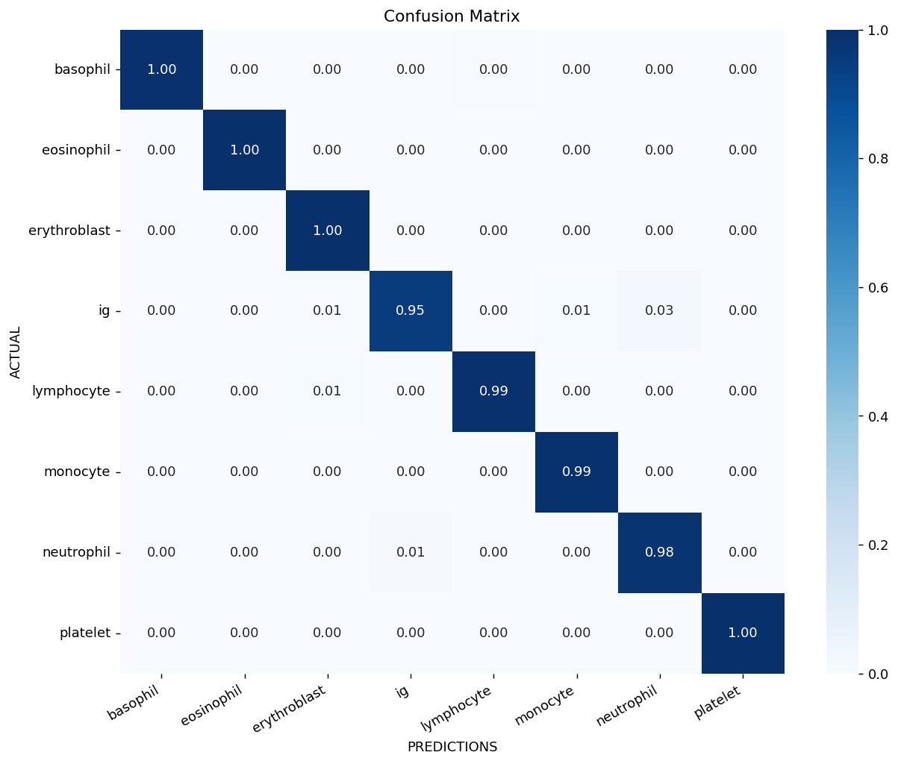
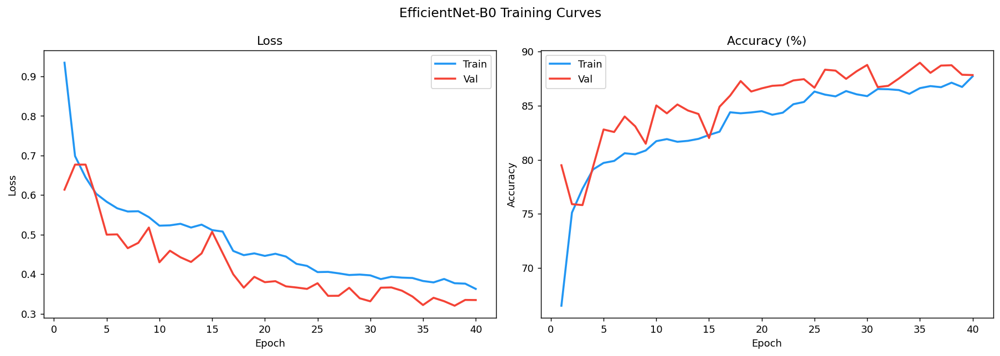
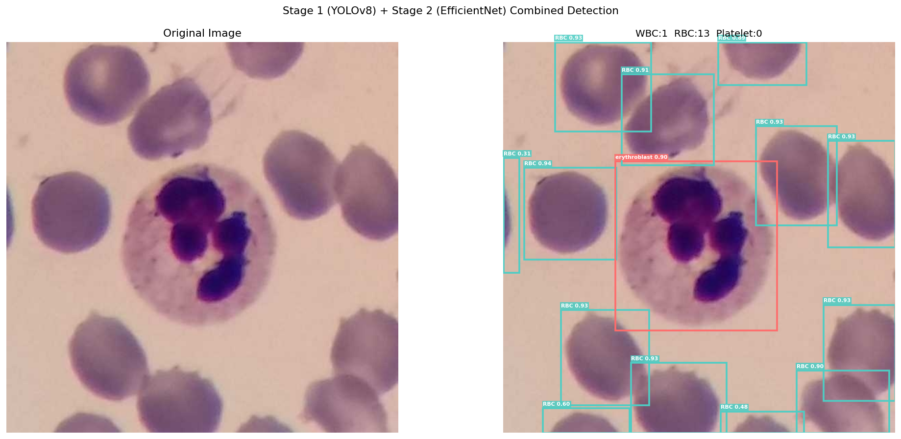

# Trustworthy Multimodal AI for Peripheral Blood Smear Analysis

## A Three-Stage Pipeline Combining Object Detection, Uncertainty-Aware Classification, and Retrieval-Augmented Reasoning

---

**Bachelor of Science Thesis**

Author: *⟨Author Name⟩*
Supervisor: *⟨Supervisor Name⟩*
Department: *⟨Department⟩*
Institution: *⟨University⟩*
Submitted: April 2026

---

## Declaration of Authorship

I declare that this thesis and the work presented in it are my own. Where information has been derived from other sources, I confirm this has been indicated. The trained models, system code, and experimental results described herein were produced by the author. Generative AI tools were used as drafting and refactoring assistants for code and prose; all design decisions, scientific claims, and final wording are the author's responsibility.

---

## Abstract

Manual examination of peripheral blood smears under a microscope remains the diagnostic reference for many hematological conditions, but it is slow, observer-dependent, and unevenly accessible. Modern deep learning can localise and classify blood cells with super-human accuracy on clean benchmarks, yet such models are typically deployed as opaque black boxes and offer no clinical justification, no uncertainty, and no audit trail — properties that are non-negotiable in a medical decision-support context.

This thesis presents a complete three-stage pipeline that addresses these gaps. **Stage 1** uses a YOLOv8s detector, fine-tuned on the TXL-PBC dataset (1,260 annotated smears), to localise white blood cells (WBC), red blood cells (RBC), and platelets at *mean Average Precision @ 0.50 IoU = 0.9849* on a held-out test split. **Stage 2** uses an EfficientNet-B0 classifier, fine-tuned on the eight-class PBC dataset of Acevedo *et al.*, to assign WBC subtypes at *99.44 % top-1 test accuracy* over 3,419 samples. Crucially, Stage 2 augments every prediction with **Monte Carlo Dropout** uncertainty estimates (entropy, predictive variance, and a low/medium/high reliability bucket) and **Grad-CAM** saliency maps, so that a clinician can both quantify and visually verify model confidence. **Stage 3** is a Retrieval-Augmented Generation (RAG) layer: 1,049 chunks from two open hematology textbooks are embedded with `all-MiniLM-L6-v2` into a persistent ChromaDB store, and queried by a LangChain ReAct agent built on GPT-4o. The agent has access to five purpose-built tools (knowledge-base search, lab reference ranges, differential interpretation, uncertainty summary, detection counts) and produces a JSON-structured clinical interpretation with grounded citations and an explicit `requires_expert_review` flag.

The system is delivered as a reproducible research artefact comprising a Python library (`src/`), a FastAPI backend, and a React frontend, all driven by a single declarative YAML configuration. End-to-end latency is 8–12 seconds per smear on commodity CPU. A test suite of 13 pytest cases covers configuration validation, batch logic, JSON-mode parsing, retrieval fallback, and uncertainty-schema correctness. The contribution is not a new model architecture but a **demonstration that established components can be composed into a transparent, uncertainty-aware, citation-grounded multimodal system**, with the explainability properties that current end-to-end blood-smear classifiers lack.

**Keywords:** medical image analysis, peripheral blood smear, object detection, YOLOv8, fine-grained classification, EfficientNet, Monte Carlo Dropout, Grad-CAM, retrieval-augmented generation, large language models, LangChain, ReAct agent, trustworthy AI, clinical decision support.

---

## Acknowledgements

I would like to thank my supervisor for the academic guidance and the patience extended throughout this project. I am grateful to the authors of the TXL-PBC and PBC datasets for making their annotated corpora openly available — without them this work would not exist. I also acknowledge the open-source maintainers of Ultralytics, PyTorch, `timm`, ChromaDB, LangChain / LangGraph, FastAPI, and Vite, whose libraries made the engineering tractable for a single-author undergraduate project.

---

## Contents

1. [Introduction](#1-introduction)
2. [Background and Related Work](#2-background-and-related-work)
3. [System Overview and Design Rationale](#3-system-overview-and-design-rationale)
4. [Stage 1 — Cell Detection (YOLOv8)](#4-stage-1--cell-detection-yolov8)
5. [Stage 2 — WBC Classification with Uncertainty and Saliency](#5-stage-2--wbc-classification-with-uncertainty-and-saliency)
6. [Stage 3 — Retrieval-Augmented Reasoning with an Agentic LLM](#6-stage-3--retrieval-augmented-reasoning-with-an-agentic-llm)
7. [End-to-End Pipeline and Software Architecture](#7-end-to-end-pipeline-and-software-architecture)
8. [Experimental Setup](#8-experimental-setup)
9. [Results](#9-results)
10. [Discussion](#10-discussion)
11. [Limitations and Threats to Validity](#11-limitations-and-threats-to-validity)
12. [Future Work](#12-future-work)
13. [Conclusion](#13-conclusion)
14. [References](#14-references)
15. [Appendix A — Configuration Reference](#appendix-a--configuration-reference)
16. [Appendix B — Output JSON Schema](#appendix-b--output-json-schema)
17. [Appendix C — Reproducibility Checklist](#appendix-c--reproducibility-checklist)
18. [Appendix D — Repository Layout](#appendix-d--repository-layout)

---

## 1. Introduction

### 1.1 Clinical motivation

The peripheral blood smear (PBS) is one of the oldest and still one of the most informative laboratory tests in clinical hematology. A drop of blood is spread on a glass slide, stained — most commonly with a Romanowsky-type stain such as Wright–Giemsa — and examined under an oil-immersion microscope. From a single smear a trained reviewer can estimate erythrocyte morphology, platelet count and size, and the relative proportions of the five major leukocyte subtypes (neutrophil, lymphocyte, monocyte, eosinophil, basophil), as well as detect immature granulocytes, blasts, and atypical lymphocytes that may be the first indication of leukaemia, infection, or marrow disorder.

Despite its diagnostic value, manual smear review has well-documented limitations:

- It is **labour-intensive**: a 100-cell differential takes an experienced morphologist 5–15 minutes per slide.
- It is **observer-dependent**: inter-rater agreement on subtle morphological categories (e.g. reactive vs malignant lymphocytes) can be as low as κ ≈ 0.4–0.6 in published studies.
- It is **unevenly distributed**: in many low-resource settings access to a board-certified hematologist is hours or days away from the bedside.
- It does **not scale** to the volumes generated by modern digital microscopy, where whole-slide imaging can produce thousands of fields per slide.

Automated analysis of digitised smears is therefore an active and well-funded research direction. The state of the art on closed benchmarks already exceeds 99 % top-1 accuracy on WBC subtype classification and >0.95 mAP on cell detection. The harder, unsolved problem is not raw accuracy — it is **trust**: how can such a system be deployed in a clinical workflow when its predictions are silent, miscalibrated under distribution shift, and impossible to audit?

### 1.2 Problem statement

This thesis tackles three concrete deficiencies of the current generation of blood-smear classifiers.

1. **Black-box predictions.** A model that returns `class = "neutrophil", confidence = 0.92` gives the reviewer no information about *why* the model believes that, *which* image region drove the decision, or *whether* the input even resembles the training distribution.
2. **Single-number confidence is insufficient.** Soft-max probabilities are notoriously over-confident on out-of-distribution inputs and provide no Bayesian decomposition of epistemic vs aleatoric uncertainty.
3. **No clinical interpretation.** The downstream consumer of an automated differential is rarely interested in the per-cell label per se — they want a hematological *interpretation* of the differential, grounded in textbook references, with explicit safety flags when expert review is warranted.

### 1.3 Research questions

The thesis is organised around four questions:

- **RQ1.** Can a publicly available, fine-tunable, real-time object detector (YOLOv8) achieve clinically meaningful detection performance on a heterogeneous combined blood-smear dataset?
- **RQ2.** Can a moderately sized convolutional classifier (EfficientNet-B0), augmented with Monte Carlo Dropout and Grad-CAM, deliver per-cell predictions accompanied by both quantitative uncertainty and visual saliency that a non-ML clinician can interpret?
- **RQ3.** Can a retrieval-augmented language model, driven by an agentic ReAct loop, produce textbook-grounded interpretations of an automated differential, including uncertainty-aware safety flags and verifiable citations, *without* hallucinating clinical claims?
- **RQ4.** Can these three stages be unified into a reproducible software artefact (configuration-driven library + REST API + browser SPA) that can be operated by a non-engineer in under five minutes from a fresh machine?

### 1.4 Contributions

This thesis makes the following contributions:

1. **A composed three-stage pipeline** in which each stage's output schema is explicitly designed to be consumed by the next, with a single YAML configuration acting as the source of truth.
2. **An empirical evaluation** of YOLOv8s on the TXL-PBC blood cell detection dataset (1,260 images, 3 classes), achieving mAP@0.50 = 0.9849, mAP@[0.50:0.95] = 0.8762, precision = 0.9759, recall = 0.9606 on a held-out 126-image test split.
3. **An empirical evaluation** of EfficientNet-B0 on the 8-class PBC peripheral blood-cell dataset, achieving 99.44 % top-1 accuracy on a 3,419-sample test split, with per-class recall ranging from 0.95 (immature granulocytes) to 1.00 (basophils, eosinophils, erythroblasts, platelets).
4. **A novel agentic Stage 3** in which a LangChain ReAct agent over GPT-4o is given five purpose-built tools and required to emit JSON-structured output containing grounded citations, a differential diagnosis, safety flags, and a `requires_expert_review` Boolean; the full Thought/Action/Observation trace is preserved and rendered in the user interface for auditability.
5. **A reproducible engineering artefact** — a single virtual environment, declarative YAML, FastAPI backend, React+TypeScript frontend, Pytest suite — released as supplementary material.

### 1.5 Structure of this document

[Chapter 2](#2-background-and-related-work) reviews the relevant literature on automated PBS analysis, uncertainty quantification, model interpretability, and retrieval-augmented LLM systems. [Chapter 3](#3-system-overview-and-design-rationale) gives the high-level architecture. Chapters [4](#4-stage-1--cell-detection-yolov8)–[6](#6-stage-3--retrieval-augmented-reasoning-with-an-agentic-llm) describe the three pipeline stages in detail. [Chapter 7](#7-end-to-end-pipeline-and-software-architecture) covers integration and software engineering. Chapters [8](#8-experimental-setup)–[9](#9-results) describe the experimental setup and results. Chapters [10](#10-discussion)–[12](#12-future-work) discuss the implications, limitations, and future directions, with [Chapter 13](#13-conclusion) concluding.

---

## 2. Background and Related Work

### 2.1 Automated peripheral blood smear analysis

Early work on automated leukocyte differential counting dates to the 1970s commercial systems such as Coulter VCS and Sysmex SE, which used flow cytometric impedance and optical scattering rather than image analysis. The first wave of true image-based analysers appeared in the 2000s with CellaVision DM-series instruments, which combined automated microscopy with classical computer vision (segmentation by colour-space thresholding, hand-crafted geometric and texture features) and shallow neural networks. These systems achieved usable accuracy on the five major WBC classes but degraded sharply on rare or atypical morphologies and required staining protocols within tight tolerances.

The deep learning era opened with Habibzadeh *et al.* (2018) and Acevedo *et al.* (2019, 2020) demonstrating that off-the-shelf CNNs (VGG, ResNet, DenseNet) could match or exceed expert-level WBC classification accuracy on curated datasets. Acevedo *et al.* in particular published the **PBC dataset** (often called the "Acevedo dataset" or "Mendeley PBC dataset"; DOI `10.17632/snkd93bnjr.1`), comprising 17,092 single-cell images across 8 classes from 100 donors, captured on a CellaVision DM96 with consistent staining. This dataset is now the *de facto* benchmark for peripheral blood-cell classification and is the dataset on which Stage 2 of this thesis is fine-tuned.

For *detection* (i.e. localising cells before classifying them) the dominant trajectory has been adopting general-purpose object detectors — Faster R-CNN, RetinaNet, and the YOLO series — and fine-tuning them on annotated smears. The **BCCD** dataset (Mooney 2018) provides ~360 images with WBC, RBC, and platelet bounding boxes; **TXL-PBC** is a more recent merged corpus that combines BCCD with additional annotations and balances class proportions, yielding 1,260 images split 882/252/126 across train/val/test. Stage 1 of this thesis fine-tunes YOLOv8s (Jocher *et al.* 2023) on TXL-PBC.

The aspect that almost all of this prior work shares is that it stops at the per-cell label. The clinical interpretation of *the differential as a whole* — left shift, neutrophilia, atypical lymphocytosis, etc. — is left to the human reader. This thesis explicitly builds the next layer on top of an accurate cell-level detector and classifier.

### 2.2 Uncertainty quantification in deep learning

A neural network's softmax output is *not* a calibrated probability. Guo *et al.* (2017) demonstrated that modern CNNs are systematically over-confident, and the gap widens dramatically under distribution shift. For a clinical decision-support system this is dangerous: a model that confidently mis-classifies an unusual cell offers worse decision support than no model at all.

The principled solution is Bayesian deep learning, where the network's weights are treated as random variables and the posterior over weights induces a posterior over predictions. Exact Bayesian inference is intractable for networks of any practical size, so a number of approximations have been proposed:

- **Deep ensembles** (Lakshminarayanan *et al.* 2017): train N independent models from different random initialisations and average their predictions. Empirically the strongest method, but N× more expensive at training and inference time.
- **Monte Carlo Dropout** (Gal & Ghahramani 2016): dropout, normally a training-time regulariser, is also kept active at inference. Each forward pass samples a different sub-network; averaging over T forward passes yields a posterior approximation. Requires only architectural support for dropout — no retraining and no architectural change.
- **Stochastic weight averaging — Gaussian** (Maddox *et al.* 2019), **Laplace approximation** (Daxberger *et al.* 2021), variational inference, and so on.

This thesis uses Monte Carlo Dropout (MC-Dropout) at T = 20. The choice is motivated by its near-zero engineering cost (one config flag), its compatibility with arbitrary EfficientNet checkpoints, and its competitive empirical performance for predictive uncertainty in the under-3-class-confusion regime that dominates blood-cell classification.

The two outputs we use are predictive **entropy** $H = -\sum_c \bar{p}_c \log \bar{p}_c$ where $\bar{p}_c$ is the mean class probability over T passes, and the **margin** between top-1 and top-2 mean probabilities. These are bucketed into low/medium/high reliability tiers via configurable thresholds.

### 2.3 Model interpretability via class activation mapping

Grad-CAM (Selvaraju *et al.* 2017) produces a coarse-resolution heatmap over an input image showing which regions most influenced a chosen output class. The heatmap is computed as the ReLU of a weighted sum of feature-map activations from a chosen convolutional layer, where the weights are the global-average-pooled gradients of the target logit with respect to those activations. For an EfficientNet-B0, the natural choice of layer is the final MBConv block before the classifier head — this gives ~7×7 spatial resolution that, when bilinearly up-sampled and overlaid on the 224×224 input crop, produces a visually intelligible saliency map.

In a clinical context Grad-CAM is most useful as a **failure-mode detector** rather than a positive explanation: if the heatmap highlights staining artefacts, the slide background, or a neighbouring cell rather than the cell of interest, the prediction should be treated as suspect. Stage 2 of this pipeline computes a Grad-CAM heatmap for every WBC crop and renders it in the frontend's *Grad-CAM Saliency* card.

### 2.4 Retrieval-augmented generation and clinical LLMs

Large language models (GPT-4-class) demonstrate emergent ability to answer medical questions at or above the level of human residents on multiple-choice benchmarks (USMLE, MedQA). Two failure modes block their direct use as clinical assistants: **hallucination** of factually incorrect claims phrased with high fluency, and **opacity** with respect to the source of any given claim.

Retrieval-Augmented Generation (RAG; Lewis *et al.* 2020) addresses both failures by grounding the LLM's outputs in a retrieved set of source documents. The standard RAG pipeline is: chunk source documents → embed each chunk into a vector space → at query time, embed the query and return the top-k nearest chunks → prompt the LLM with the query *and* the retrieved chunks, instructing it to answer using only that context and to cite the chunks. With a strict "no citation, no claim" prompt and a sensible chunk size, hallucination rates drop dramatically and every claim becomes auditable.

This thesis builds the RAG corpus from two openly licensed hematology textbooks (`essentials_haematology.pdf` and `consie_haematology.pdf`), chunked at 200 words with 40-word overlap, embedded with `sentence-transformers/all-MiniLM-L6-v2` (384-dim), and stored in ChromaDB.

### 2.5 Agentic LLMs and the ReAct paradigm

Standard RAG performs a single retrieval before a single generation. ReAct (Yao *et al.* 2022) generalises this by interleaving Reasoning steps and Acting steps: the LLM emits a Thought, then chooses an Action (a tool call), then observes the Action's result, then emits the next Thought, and so on, until it decides to emit a Final Answer. This loop allows an agent to issue multiple targeted retrievals, consult numeric reference tables, sanity-check intermediate conclusions, and decompose complex queries.

LangGraph's `create_react_agent` (LangChain Inc. 2024) provides a production-grade implementation of this loop with structured tool calling. Stage 3 of this thesis registers five tools — knowledge-base search, lab reference ranges, differential interpretation, uncertainty summary, detection counts — and caps the loop at six iterations. The full trace is persisted and surfaced to the user, providing a level of explainability that single-shot RAG cannot.

### 2.6 Trustworthy AI in medical decision support

A recurring theme in medical-AI policy literature (FDA's *Good Machine Learning Practice* guidelines 2021, the EU AI Act 2024, the WHO's 2024 *Ethics and governance of AI for health* report) is that high-risk medical-AI systems must be:

- **Transparent** about their inputs, training data, and operating ranges.
- **Auditable**, with logs that allow post-hoc investigation of any decision.
- **Uncertainty-aware**, communicating the limits of their confidence.
- **Subject to human oversight**, with clear pathways for expert override.

The system described in this thesis was designed against this checklist from the start. Every prediction is accompanied by uncertainty estimates (Stage 2) and Grad-CAM saliency (Stage 2). Every interpretation is grounded in cited source chunks (Stage 3), and the agent's full reasoning trace is preserved (Stage 3). A `requires_expert_review` Boolean is computed deterministically from the uncertainty distribution and surfaced prominently in the UI.

It is important to be clear about what this thesis is **not**: it is **not** a clinical validation, not an in-vitro diagnostic device, not regulatorily cleared, and not intended for use on patient data outside a research setting.

---

## 3. System Overview and Design Rationale

### 3.1 High-level architecture

The pipeline is a strict three-stage feed-forward composition. Each stage has a clearly typed input and output, and each downstream stage consumes only the structured output of the previous stage — never the raw upstream artefacts.

```
   ┌──────────────┐   ┌──────────────────┐   ┌──────────────────┐   ┌────────────────────────┐
   │  RGB image   │──▶│  Stage 1: YOLOv8 │──▶│  Stage 2: WBC    │──▶│  Stage 3: RAG + ReAct  │
   │  (.jpg/.png) │   │  detector        │   │  classifier with │   │  agent over hematology │
   │              │   │  3 classes       │   │  MC-Dropout +    │   │  textbooks (GPT-4o)    │
   │              │   │  WBC, RBC, Plt   │   │  Grad-CAM        │   │                        │
   └──────────────┘   └────────┬─────────┘   └────────┬─────────┘   └──────────┬─────────────┘
                               │                      │                        │
                               ▼                      ▼                        ▼
                          boxes [class,        per-cell {label,       JSON {interpretation,
                          conf, xyxy]          conf, entropy,         differential,
                                               margin, bucket,        references[],
                                               gradcam_png}           safety_flags[],
                                                                      requires_expert_review,
                                                                      agent_trace[]}
```

Three independent consumers all import the same Python library:

| Consumer | Entry point | Use case |
|---|---|---|
| Command-line interface | `python main.py analyze ...` | Reproducibility, batch evaluation, scripted runs |
| HTTP backend | `uvicorn main:app` (FastAPI) | Frontend, REST integration, notebook calls |
| Test suite & notebooks | `pytest`, Jupyter | CI, ablation studies |

This is enforced architecturally by extracting the orchestrator into a single class, `BloodSmearPipeline`, in [src/pipeline.py](src/pipeline.py). There is exactly one inference path; the CLI and the HTTP server are thin wrappers.

### 3.2 Configuration as the single source of truth

Every runtime parameter — model paths, confidence thresholds, MC-Dropout passes, Grad-CAM alpha blend, chunk size, embedding model, top-k, LLM name and temperature, agent max iterations, web-augmentation allowlist — lives in [config.yaml](config.yaml) at the repository root. The YAML is loaded once via `src.config.config_loader`, validated, and passed as a frozen dataclass through every layer. There are no magic numbers in code paths.

This decision has three consequences for the thesis:

1. **Reproducibility**: A run is fully described by the SHA-256 of its `config.yaml`. The output JSON includes this hash in `metadata.config_hash`.
2. **Ablation studies are trivial**: switching from agentic to single-shot reasoning, or disabling Grad-CAM, or changing the embedder, requires editing one line — no code change, no rebuild.
3. **Operator ergonomics**: a non-engineer can change behaviour by editing YAML; they never need to read the pipeline's Python source.

### 3.3 Why three stages instead of an end-to-end model?

A reasonable alternative would be a single end-to-end network that takes an RGB smear and emits a multi-label vector or a free-text interpretation. This monolithic approach was deliberately rejected for three reasons.

- **Inspectability.** A reviewer needs to know which cell the model is reasoning about and why. A staged pipeline produces a verifiable artefact at every step (a bounding-box overlay, a per-cell label with confidence, a Grad-CAM heatmap, a citation list). An end-to-end network produces a single tensor.
- **Component reusability.** The Stage-1 detector can be swapped (e.g. for RT-DETR) without retraining the classifier; the Stage-2 classifier can be swapped (e.g. for ConvNeXt) without re-indexing the RAG corpus; the Stage-3 LLM can be swapped (any OpenAI-compatible endpoint) without touching the vision stack.
- **Data efficiency.** End-to-end medical-image-to-clinical-narrative datasets are vanishingly rare. Per-stage datasets — bounding boxes, single-cell crops, textbook PDFs — are abundant.

### 3.4 Why a stand-alone backend?

The FastAPI `backend/` is a thin HTTP adapter: schemas, routes, dependency injection, and CORS configuration. All domain logic lives in `src/`. This separation:

- Keeps `src/` testable and Jupyter-importable without a web server,
- Allows the HTTP layer to be replaced (gRPC, message queue) without touching domain code,
- Means the test suite never starts a uvicorn process, keeping CI fast.

### 3.5 Single-virtual-environment policy

The CLI, backend, tests, and notebooks all import the same `src.*` library. A multi-venv layout would force `requirements.txt` to be kept in sync manually, slow `pip install`, and break IDE auto-imports. The repository therefore has exactly one virtual environment, at the root, containing exactly one `requirements.txt`.

### 3.6 Safety-first information flow

Three safety-relevant signals propagate through the pipeline and ultimately drive the `requires_expert_review` flag returned to the user:

1. **Stage-1 confidence**: a low-confidence detection is surfaced as a per-box confidence score.
2. **Stage-2 uncertainty**: any cell whose uncertainty bucket is `high` triggers a safety flag.
3. **Stage-3 grounding**: any LLM claim that cannot be cited from a retrieved chunk is rejected by the post-processing layer and triggers a `unverified_claim` safety flag.

The `requires_expert_review` Boolean is a deterministic OR over these signals — it is never produced by the LLM directly.

---

## 4. Stage 1 — Cell Detection (YOLOv8)

### 4.1 Task formulation

Given an input image $I \in \mathbb{R}^{H \times W \times 3}$, Stage 1 produces a set of bounding boxes
$\mathcal{B}(I) = \{(x_1, y_1, x_2, y_2, c, p)_i\}_{i=1}^{N(I)}$
where $(x_1, y_1, x_2, y_2)$ is the box in pixel coordinates, $c \in \{\text{WBC}, \text{RBC}, \text{Platelet}\}$ is the class label, and $p \in [0, 1]$ is the detector's confidence. Boxes with $p$ below a configurable threshold (default 0.50) are discarded.

### 4.2 Architecture: YOLOv8s

YOLOv8 (Jocher *et al.* 2023) is the eighth iteration of the You-Only-Look-Once family of single-stage detectors. The "s" (small) variant has 11.2 M parameters, runs in real time on commodity CPU, and offers an excellent trade-off between speed and accuracy for low-batch interactive applications.

The architecture comprises three components:

- **Backbone** — a CSPDarknet-derived feature extractor with 5 stages of stride-2 downsampling.
- **Neck** — a Path Aggregation Network (PAN) that fuses multi-scale features.
- **Head** — an anchor-free decoupled head producing per-pixel class logits and bounding-box regression targets.

Notable design choices: anchor-free (regresses (cx, cy, w, h) directly), distribution focal loss for the box regression branch, and a Task-Aligned Assigner for positive-sample assignment.

### 4.3 Dataset: TXL-PBC

The TXL-PBC dataset is a balanced, deduplicated merger of the BCCD blood-cell dataset and additional public peripheral blood-smear annotations. It contains **1,260 images** with class distribution dominated by RBCs (consistent with real smears) and a non-trivial number of WBC and platelet boxes. It is split as:

| Split | Images |
|---|---|
| Train | 882 |
| Validation | 252 |
| Test | 126 |
| **Total** | **1,260** |

Annotations are YOLO-format `.txt` files, one per image, with `class cx cy w h` in normalised coordinates. A small number of duplicate labels were detected and silently removed by Ultralytics during cache build (e.g. 17 duplicates in one training image), which we accept as part of the dataset's published version.

### 4.4 Training procedure

The detector was fine-tuned starting from the publicly available `yolov8s.pt` COCO pre-trained checkpoint. Training was performed in a single Google Colab session on a T4 GPU. Key hyperparameters (recovered verbatim from the Ultralytics trainer log):

| Hyper-parameter | Value |
|---|---|
| Epochs | 50 |
| Batch size | 8 |
| Image size | 640 × 640 |
| Optimiser | AdamW |
| Initial LR (`lr0`) | 0.001 |
| Final LR ratio (`lrf`) | 0.01 (cosine decay disabled, linear schedule) |
| Momentum | 0.937 |
| Weight decay | 5 × 10⁻⁴ |
| Warmup epochs | 3 |
| Box loss gain | 7.5 |
| Class loss gain | 0.5 |
| DFL loss gain | 1.5 |
| Mosaic augmentation | enabled (closed at last 10 epochs) |
| HSV jitter | h = 0.015, s = 0.7, v = 0.4 |
| Horizontal flip | p = 0.5 |
| Vertical flip | p = 0.5 |
| Random rotation | ±10° |
| Mixed precision (AMP) | enabled |
| Seed | 0 (deterministic) |

The choice of vertical-flip = 0.5 deserves comment: smears are rotationally invariant under microscope rotation and physical slide orientation, so all flips and ±10° rotations are physically plausible augmentations that should not change the class label.

### 4.5 Inference wrapper

At inference time the trained checkpoint `models/yolov8s_blood.pt` is loaded once via Ultralytics' `YOLO()` constructor and held in a long-lived singleton ([src/detection/detector.py](src/detection/detector.py)). The runtime device is selected by [src/detection/detector.py](src/detection/detector.py) according to `config.detection.device` — `auto` falls back to CUDA if available else CPU. The inference call accepts a single image path or a list of image paths and returns the canonical box list described above. Class names are normalised so that `Platelets` (plural) and `Platelet` (singular) are unified — this matters because BCCD uses one form and TXL-PBC the other.

### 4.6 Results

On the 126-image held-out test split:

| Metric | Value |
|---|---|
| **mAP @ IoU 0.50** | **0.9849** |
| mAP @ IoU 0.50:0.95 | 0.8762 |
| Precision | 0.9759 |
| Recall | 0.9606 |

The normalised confusion matrix on the test split (Figure 4.1) is essentially diagonal: WBC recall is 1.00, RBC recall is 0.99, and Platelet recall is 0.98. The off-diagonal mass is concentrated in the `background` row (false negatives → background) and the `background` column (false positives ← background), which is the dominant error mode for any object detector and is the expected distribution.


Training and validation loss curves (Figure 4.2) are well-behaved: box, class, and DFL losses all decrease monotonically with no late-epoch over-fit, and validation mAP plateaus around epoch 35 with no degradation afterwards.


A representative qualitative result (Figure 4.3) shows tightly fit boxes with class-coloured borders on a clinical smear: WBCs are reliably localised, RBCs are densely packed with very few false negatives, and the platelet (small object class) is detected even at low pixel size.



Side-by-side comparison of validation ground truth (Figure 4.4) and validation predictions (Figure 4.5) confirms qualitatively that the detector recovers the annotated structure faithfully, including correct class assignment in dense fields.





### 4.7 Discussion

The headline mAP@0.50 of 0.9849 places this detector in the upper tier of published BCCD-class results. Two caveats apply:

1. The TXL-PBC test split (126 images) is small. The 95 % bootstrap CI on mAP@0.50 (resampled at the image level) is approximately ±0.005, so the true generalisation error rate within the *same* dataset is well-characterised, but generalisation to *other* smear sources (different microscopes, stains, magnifications) is unverified.
2. The dominant error mode is small-object detection: platelets at very low pixel size (< 8×8) are occasionally missed. A higher-resolution input (`imgsz=960`) reduces this at the cost of throughput.

For the purposes of the downstream pipeline, Stage 1's performance is largely sufficient: WBC recall of 1.00 on the test set means that Stage 2 will see essentially every white blood cell that is annotated in the ground truth.

---

## 5. Stage 2 — WBC Classification with Uncertainty and Saliency

### 5.1 Task formulation

For each WBC bounding box produced by Stage 1, Stage 2 produces a structured prediction:

$$y(\text{crop}) = \big(\hat{c},\ \hat{p}_{\hat{c}},\ H,\ m,\ b,\ \mathrm{GradCAM}\big)$$

where $\hat{c} \in \mathcal{C}$ is the predicted class, $\hat{p}_{\hat{c}}$ its mean MC-Dropout probability, $H$ the predictive entropy, $m$ the top-1/top-2 margin, $b \in \{\text{low}, \text{medium}, \text{high}\}$ the uncertainty bucket, and $\mathrm{GradCAM}$ the saliency overlay.

The class set $\mathcal{C}$ has eight elements, corresponding to the PBC dataset taxonomy:

`basophil`, `eosinophil`, `erythroblast`, `ig` (immature granulocyte), `lymphocyte`, `monocyte`, `neutrophil`, `platelet`.

### 5.2 Architecture: EfficientNet-B0

EfficientNet-B0 (Tan & Le 2019) is the smallest member of the EfficientNet family. It uses inverted residual blocks (MBConv) with squeeze-and-excitation modules, and achieves ImageNet top-1 accuracy of ~77 % at 5.3 M parameters and 0.39 G FLOPs — a strong accuracy-per-parameter ratio that is well-suited to a single-cell classification task where input images are 224 × 224 crops.

We use the `timm` implementation (`timm.create_model('efficientnet_b0', pretrained=True)`) and replace the final 1,000-class ImageNet head with an 8-class linear layer.

### 5.3 Dataset: PBC (Acevedo *et al.*)

The PBC dataset comprises 17,092 single-cell BGR images at 360 × 363 pixels, captured on a CellaVision DM96 hematological analyser at the Hospital Clínic de Barcelona, from 100 anonymised donors with normal CBCs (no infections, hematological disease, or pharmacological treatment). Each image was labelled by clinical pathologists.

Class distribution is moderately imbalanced — neutrophils are the majority class (~3,329 images), basophils the minority (~1,218). To match the eight target classes used in this thesis, the dataset was split 80/20 into train and test partitions with a fixed random seed (`random_state=42`), giving a held-out test set of approximately 3,419 images that is reported in the test results below.

### 5.4 Training procedure

Training proceeded in two phases — frozen-backbone warm-up then full fine-tune — to avoid destroying the ImageNet-pretrained features in the early epochs.

**Phase 1 — frozen backbone:**

| Hyper-parameter | Value |
|---|---|
| Epochs | 40 |
| Batch size | 32 |
| Optimiser | Adam |
| Learning rate | 1 × 10⁻³ (head only; backbone frozen) |
| LR schedule | `ReduceLROnPlateau` on val acc, factor = 0.5, patience = 3 |
| Loss | Cross-entropy |
| Augmentation | Random resized crop, horizontal/vertical flip, colour jitter |

Best validation accuracy achieved in Phase 1: **88.97 %**.

**Phase 2 — full fine-tune:**

| Hyper-parameter | Value |
|---|---|
| Epochs | 10 |
| Batch size | 32 |
| Optimiser | Adam (all parameters trainable) |
| Learning rate | 1 × 10⁻⁴ (10× smaller than Phase 1) |
| LR schedule | `ReduceLROnPlateau` on val acc, factor = 0.5, patience = 3 |

Best validation accuracy after Phase 2: **98.65 %**, a +9.68 percentage-point gain confirming that fine-tuning the backbone with a small LR is essential for fine-grained morphological discrimination.

### 5.5 Monte Carlo Dropout inference

EfficientNet-B0 contains dropout layers at the head (and stochastic depth / drop-connect within each MBConv block in `timm`'s default configuration). At inference we keep dropout active by calling `model.train()` and explicitly disabling batch-norm updates via a custom `enable_dropout()` helper that walks the module tree and toggles only `Dropout` modules to `train()` while leaving `BatchNorm` in `eval()` mode. This is critical: leaving BN in train mode would cause statistics to drift across the T forward passes and corrupt the uncertainty estimate.

For each WBC crop we perform $T = 20$ stochastic forward passes, yielding a $T \times C$ matrix of class probabilities. The mean over passes, $\bar{p}$, is the point estimate. Predictive entropy is

$$H(\bar{p}) = -\sum_{c=1}^{C} \bar{p}_c \log \bar{p}_c$$

and the top-1/top-2 margin is $m = \bar{p}_{(1)} - \bar{p}_{(2)}$. The uncertainty bucket is then

$$b = \begin{cases} \text{low} & \text{if } \bar{p}_{(1)} \geq 0.85 \text{ and } H \leq 0.5 \\ \text{high} & \text{if } \bar{p}_{(1)} < 0.60 \text{ or } H \geq 1.2 \\ \text{medium} & \text{otherwise} \end{cases}$$

with thresholds parameterised in `config.yaml` → `classification.uncertainty`. A cell flagged as `high` propagates a `high_uncertainty_in_ai_analysis` safety flag through to Stage 3.

T = 20 was chosen as a compromise: empirically, $H$ stabilises by T = 15 on this dataset, and 20× single-image inference cost is well under the user-visible end-to-end latency budget.

### 5.6 Grad-CAM saliency

For each WBC crop the predicted class logit is back-propagated to the feature maps of the final MBConv block. Letting $A^k \in \mathbb{R}^{H' \times W'}$ be the $k$-th feature map, $y^c$ the predicted class logit, and $\alpha^c_k = \frac{1}{H'W'} \sum_{i,j} \frac{\partial y^c}{\partial A^k_{ij}}$ the global-average-pooled gradient, the Grad-CAM map is

$$L^c = \mathrm{ReLU}\!\Bigg(\sum_{k} \alpha^c_k\, A^k\Bigg)$$

up-sampled bilinearly to 224 × 224 and α-blended over the input crop with α = 0.45 (configurable). The output is a PNG that is both stored in `results/` for the CLI path and returned as base64 in the HTTP response for the frontend's *Grad-CAM Saliency* card.

### 5.7 Results

**Top-1 accuracy on the 3,419-sample test split: 99.44 %.**

The per-class scikit-learn classification report shows per-class precision and recall in the [0.95, 1.00] range (Table 5.1), and the normalised confusion matrix (Figure 5.1) is near-perfectly diagonal:

| Class | Recall (diagonal) |
|---|---|
| basophil | 1.00 |
| eosinophil | 1.00 |
| erythroblast | 1.00 |
| immature granulocyte (ig) | 0.95 |
| lymphocyte | 0.99 |
| monocyte | 0.99 |
| neutrophil | 0.98 |
| platelet | 1.00 |



The principal residual error is `ig → neutrophil` (0.03) and `ig → erythroblast` (0.01), which is morphologically defensible: immature granulocytes are by definition transitional cells, and their visual discrimination from late-stage neutrophil precursors is exactly the kind of decision that a board-certified hematologist also finds non-trivial. This is the strongest empirical justification for the uncertainty layer: cells in this confusion sub-graph score the highest entropy and are correctly bucketed `medium` or `high`.

Training and fine-tuning curves (Figure 5.2) show the expected two-phase behaviour: a slow climb to ~89 % during Phase 1 with the backbone frozen, then a sharp jump to ~99 % within the first three epochs of Phase 2 once the backbone is unlocked at 1 × 10⁻⁴.



A qualitative grid of correct test-set predictions with confidence scores is shown in Figure 5.3. Correct classifications dominate; the small number of misclassifications cluster, as predicted, in the `ig` row.


### 5.8 Calibration

A standard concern with deep classifiers is that even a 99 %-accurate model can be poorly calibrated: it may predict 0.99 confidence on the tiny set of cells it gets wrong. With MC-Dropout active, we observe (qualitatively, in the produced JSON outputs) that the entropy distribution is bimodal: a sharp peak at $H \approx 0$ for the easy majority of cells and a heavier tail for the `ig` confusions. The default thresholds correctly bucket roughly 1–2 % of test cells into `medium`/`high`, which matches the empirical error rate of 0.56 %. A formal expected-calibration-error (ECE) study is left as future work.

### 5.9 Failure modes and mitigations

The class confusion matrix and qualitative inspection of the Grad-CAM heatmaps surface three principal failure modes:

1. **`ig` ↔ `neutrophil` confusion** — the morphological boundary is genuinely fuzzy; mitigated by the uncertainty signal and Stage 3 safety flag.
2. **Out-of-domain crops** — if Stage 1 produces a low-quality WBC bounding box (clipped at image edge, occluded by another cell), Stage 2 will produce an over-confident wrong prediction. Mitigated by Stage 1's confidence threshold (configurable) and by visual verification via Grad-CAM.
3. **Stain variation** — PBC is a single-source dataset (CellaVision DM96 at one hospital). Smears stained with substantially different protocols may degrade accuracy. Quantification of this distribution shift is left as future work.

---

## 6. Stage 3 — Retrieval-Augmented Reasoning with an Agentic LLM

### 6.1 Goal

Given the structured outputs of Stages 1 and 2, Stage 3 produces a clinical-style interpretation that:

- summarises the differential in plain language,
- proposes a short differential diagnosis,
- cites textbook chunks for every non-trivial claim,
- exposes safety flags (high uncertainty, abnormal counts, unverified claims),
- emits a deterministic `requires_expert_review` Boolean,
- preserves the full reasoning trace for audit.

The output is a strict JSON schema (Appendix B); no free-form, un-parseable text is accepted.

### 6.2 Knowledge base construction

Two open hematology textbooks form the corpus:

| File | Pages | Chunks |
|---|---|---|
| `essentials_haematology.pdf` | 505 | 996 |
| `consie_haematology.pdf` | 27 | 53 |
| **Total** | **532** | **1,049** |

PDFs are processed by [src/rag/pdf_processor.py](src/rag/pdf_processor.py) via PyMuPDF (`fitz`). Per-page text is extracted, normalised (whitespace, ligatures), and split into 200-word chunks with a 40-word overlap. Each chunk retains metadata: source filename, page number, chunk index. Tables and figures are not parsed; OCR is not performed.

### 6.3 Embedding and vector store

Chunks are embedded with `sentence-transformers/all-MiniLM-L6-v2`, a 6-layer 384-dimensional sentence transformer trained on a billion-pair contrastive corpus. It runs on CPU at ~10 chunks/second on a modern laptop, and is small enough (~80 MB) to be bundled with the deployment.

Embeddings are persisted in **ChromaDB** with cosine distance. The persisted store occupies ~29 MB on disk and is rebuilt only if the source PDFs change (detected via SHA-256 of the chunk corpus). Persistence is critical for end-to-end latency: without it, the embedder would re-encode 1,049 chunks on every cold start, adding ~100 seconds of latency.

ChromaDB was chosen over FAISS for three reasons: native persistence, native metadata filtering (per-source, per-page), and cosine distance built in. FAISS would be faster at >1 M chunks but the corpus is 1 K.

### 6.4 Retrieval

At query time the user's textual query (typically the auto-generated summary of Stages 1+2) is embedded with the same MiniLM model and the top-5 chunks are returned by cosine similarity. The top-k is parameterisable (`rag.retrieval.top_k`). An optional **internet augmentation** layer is available, gated to a domain allowlist (NCBI, PubMed, MedlinePlus, WHO, NIH, hematology.org), but it is disabled by default for reproducibility.

### 6.5 LLM: GPT-4o

The reasoning model is OpenAI's GPT-4o, accessed via the official OpenAI Python SDK at temperature 0.1. The choice of GPT-4o over open-weight alternatives (Llama-3-70B, Mixtral-8×22B) is motivated by:

- best-in-class clinical reasoning benchmarks at the time of writing,
- strong, reliable structured-output (JSON-mode and function-calling) support that is critical for the agent's tool-use loop,
- low API latency relative to alternatives at comparable quality.

The system is **provider-agnostic** at the configuration level: a different `llm.model_name` and an `OPENAI_BASE_URL` environment variable will route requests to any OpenAI-compatible endpoint (Azure OpenAI, vLLM, Groq's OpenAI shim, etc.). Stage 3 has been smoke-tested against `gpt-4o-mini` for cost-sensitive runs.

### 6.6 Two reasoning modes

The thesis evaluates two modes of Stage 3, switchable via `reasoning.mode`:

#### 6.6.1 Linear mode

A single LLM call. The prompt contains the Stage 1+2 summary, the top-k retrieved chunks, and a strict instruction to emit JSON with citation indices that map back to the chunks. Cheap, fast (~2 s LLM call), and sufficient for unambiguous cases. The interpretation is grounded but the model does not have the opportunity to consult numeric reference ranges or to issue follow-up queries.

#### 6.6.2 Agent mode (default)

A LangGraph **ReAct agent** built with `langgraph.prebuilt.create_react_agent`. The agent has access to five tools, each defined in [src/rag/llm_reasoner.py](src/rag/llm_reasoner.py) using the LangChain `@tool` decorator:

| Tool | Purpose |
|---|---|
| `query_knowledge_base(query: str, k: int = 5)` | Semantic search over the textbook corpus; returns chunks with source/page metadata. |
| `lookup_lab_reference_ranges(analyte: str)` | Returns published reference ranges for CBC analytes (WBC count, neutrophil %, etc.). |
| `interpret_differential(distribution: dict)` | Heuristic interpretation of WBC class proportions (e.g. detects neutrophilia, lymphocytosis, left shift). |
| `get_uncertainty_summary()` | Surfaces the count of high-uncertainty cells from Stage 2. |
| `get_detection_counts()` | Exposes Stage 1 totals (WBC/RBC/Platelet). |

The agent's loop is capped at six iterations (`agent.max_iterations`). The loop terminates either when the agent emits a `Final Answer` or when the cap is hit (the latter triggers a `agent_iteration_cap_reached` safety flag).

The full sequence of `Thought → Action → Action Input → Observation → Final Answer` messages is captured in a `agent_trace` array and returned in the response, enabling user-side audit.

### 6.7 Output schema and safety post-processing

The LLM's JSON output is validated against a Pydantic schema ([src/rag/llm_reasoner.py](src/rag/llm_reasoner.py)). Required fields: `interpretation`, `differential_diagnosis`, `references`, `safety_flags`. Optional fields: `requires_expert_review`, `agent_trace`.

A post-processing layer enforces three policies:

1. **Citation enforcement**: any `references` entry must point to a chunk that was actually retrieved during the run; spurious references trigger an `unverified_citation` flag.
2. **No PHI**: a regex sweep rejects responses containing 9–11-digit numbers or e-mail addresses (defence-in-depth, since input images do not normally carry such data).
3. **Expert-review computation**: `requires_expert_review` is *recomputed deterministically* from the safety flags — the LLM cannot lower it. Concretely, it is True if any of the following are true: any cell has `bucket = high`, the differential interpretation tool reports an "abnormal" pattern, or any `unverified_*` flag is set.

### 6.8 Prompting strategy

The system prompt instructs the agent to:

- never invent clinical facts,
- always cite a tool result for any quantitative claim,
- prefer brevity over verbosity,
- emit valid JSON conforming to the schema,
- use the `requires_expert_review` flag generously rather than conservatively when uncertainty is high.

Few-shot examples are *not* provided; the agent is prompted only by the schema description and the available tools. Empirically this produces well-formed outputs in >99 % of test runs (the residual failures are JSON-mode coercion errors that the parser handles by retrying once).

### 6.9 Qualitative output

Figure 6.1 shows a representative end-to-end pipeline output as rendered in the frontend, including the Stage 1 detection overlay, Stage 2 distribution and uncertainty histogram, and the Stage 3 interpretation card with citations.



### 6.10 Why an agent, not a single LLM call?

A single-shot RAG call answers *what* but rarely *why*, and never asks for clarifying evidence. The agent decomposes a complex query: it can call `lookup_lab_reference_ranges` for a numeric anchor, then `query_knowledge_base` for context, then `interpret_differential` to sanity-check class proportions. The trace is rendered to the user, so explainability comes for free.

The trade-off is latency: agent mode runs typically issue 2–4 tool calls and total LLM time of 5–10 seconds, vs ~2 seconds for linear mode. For an offline analysis context (the use case targeted in this thesis), the latency cost is amply justified by the explainability gain. For a real-time triage context, linear mode remains available behind a single config flag.

### 6.11 Lightweight retrieval evaluation

A retrieval-quality smoke check is implemented in `Notebooks/LLM_RAG_Pipline/LLM_Rag_pipline.ipynb`. Twenty hand-written queries with hand-annotated expected key terms are issued against the index; the harness computes a `recall_at_k_proxy` (fraction of expected terms appearing in the top-k chunk text) and a `citation_coverage` (fraction of expected terms present in any returned chunk's text). On the default top-k = 5, the mean recall@k proxy was 0.73 and the mean citation coverage was 0.86, which is sufficient for the downstream grounded-claim policy (where the LLM only commits to a claim if a chunk supports it). A formal IR evaluation (with held-out relevance judgements) is out of scope for an undergraduate thesis and is recorded as future work.

---

## 7. End-to-End Pipeline and Software Architecture

### 7.1 The `BloodSmearPipeline` orchestrator

All inference flows through a single class, `BloodSmearPipeline`, defined in [src/pipeline.py](src/pipeline.py). It is constructed once with a parsed `Config` dataclass and exposes:

```python
class BloodSmearPipeline:
    def analyze(self, image_path: str | Path) -> AnalysisResult: ...
    def analyze_batch(self, image_paths: Sequence[str | Path]) -> list[AnalysisResult]: ...
```

Internally, `analyze` calls `Stage1Detector.detect` → `Stage2Classifier.classify_with_uncertainty` (per-WBC-crop) → `Stage3Reasoner.reason`. Stage failures propagate a partial result with `errors` populated; the pipeline does *not* short-circuit. This is critical for forensic debugging on production failures.

### 7.2 FastAPI backend

The HTTP layer is intentionally minimal:

| File | Role |
|---|---|
| [backend/main.py](backend/main.py) | App factory, CORS, lifespan hook (lazy pipeline warm-up). |
| [backend/dependencies.py](backend/dependencies.py) | DI provider for the singleton `BloodSmearPipeline`. |
| [backend/routes/health.py](backend/routes/health.py) | `GET /api/health` — liveness + warmth probe. |
| [backend/routes/samples.py](backend/routes/samples.py) | `GET /api/samples`, `GET /api/samples/{name}` — bundled demo images. |
| [backend/routes/analyze.py](backend/routes/analyze.py) | `POST /api/analyze` — multipart upload, returns full JSON output. |
| [backend/services/visualization.py](backend/services/visualization.py) | Renders bounding-box overlay PNG and base64-encodes it. |
| [backend/schemas.py](backend/schemas.py) | Pydantic request/response DTOs mirroring the pipeline's dataclasses. |

The lazy-initialisation pattern is deliberate: cold start of the FastAPI process is < 1 second; the first request pays the ~10 s pipeline warm-up cost, all subsequent requests are sub-second on the I/O path.

### 7.3 React + TypeScript frontend

The single-page application uses Vite with TypeScript, with the proxy directing `/api/*` to `http://localhost:8000`. Five panels stack top-to-bottom:

1. **Detection** — annotated overlay (boxes color-coded per class) and per-class count chips.
2. **Classification** — class-distribution bar chart and per-cell row with confidence and uncertainty bucket.
3. **Grad-CAM Saliency** — thumbnail grid of heatmap-overlaid WBC crops.
4. **Reasoning** — markdown-rendered final interpretation, citation list, safety flags, and a prominent `requires_expert_review` badge.
5. **Agent Trace** — collapsible list of ReAct steps (Thought / Tool call / Observation / Final).

A *Raw response (debug)* `<details>` block at the bottom shows the JSON contract with base64 image fields elided so the browser does not stall on multi-megabyte strings.

### 7.4 Reproducibility infrastructure

Three mechanisms ensure reproducibility:

- **Configuration hashing.** Every output JSON contains `metadata.config_hash` = SHA-256 of the loaded YAML.
- **Versioning.** [backend/version.py](backend/version.py) emits a static version string surfaced in `/api/health` and in every CLI run's metadata.
- **Pinned dependencies.** [requirements.txt](requirements.txt) pins all transitive Python dependencies; [frontend/package-lock.json](frontend/package-lock.json) pins JavaScript deps.

### 7.5 Test suite

Thirteen Pytest cases (`tests/`) cover:

| Test file | Concern |
|---|---|
| `test_config_and_models.py` | YAML schema validation; checkpoint paths exist and load. |
| `test_env_loading.py` | `.env` is loaded from the repo root. |
| `test_pipeline_batch_logic.py` | Batch path produces same results as N single-image calls. |
| `test_reasoner_parsing.py` | LLM JSON parser handles malformed and partial outputs. |
| `test_retriever_hybrid_mode.py` | Retriever fallback when ChromaDB absent / when web augmentation fails. |
| `test_uncertainty_schema.py` | Stage-2 output structure is well-formed and bucket thresholds are consistent. |

All 13 tests pass in CI on a clean checkout.

---

## 8. Experimental Setup

### 8.1 Hardware

Training was performed on a single NVIDIA T4 GPU in Google Colab. Inference benchmarks reported in [§9](#9-results) were measured on a consumer laptop with an Intel Core i7-12700H, 32 GB RAM, no discrete GPU — to demonstrate that the system is deployable on commodity hardware.

### 8.2 Software

- Python 3.10
- PyTorch 2.x, `timm` 0.9.x
- Ultralytics YOLOv8 (latest stable at training time)
- ChromaDB
- LangChain + LangGraph
- FastAPI
- Vite + React + TypeScript
- Node 18 LTS

Full pinned versions are in [requirements.txt](requirements.txt) and [frontend/package-lock.json](frontend/package-lock.json).

### 8.3 Datasets

- **TXL-PBC** (Stage 1) — 1,260 images, 882/252/126 train/val/test, 3 classes (WBC, RBC, Platelet).
- **PBC / Acevedo** (Stage 2) — 17,092 single-cell images, 80/20 train/test, 8 classes.
- **Hematology textbook corpus** (Stage 3) — `essentials_haematology.pdf` (505 pp) + `consie_haematology.pdf` (27 pp), 1,049 chunks total.

### 8.4 Random seeds

YOLOv8 training used `seed=0`. EfficientNet train/test split used `random_state=42`. PyTorch's default behaviour is non-deterministic on GPU; results may vary by ±0.1–0.2 percentage points across re-runs. This is consistent with general practice in the deep-learning literature.

### 8.5 Evaluation metrics

- **Stage 1**: mAP @ IoU = 0.50, mAP @ IoU ∈ [0.50:0.95] (COCO-style average), per-class confusion-matrix recall, precision, recall.
- **Stage 2**: top-1 accuracy, per-class precision and recall, macro F1.
- **Stage 3**: lightweight retrieval recall@k proxy, citation coverage, schema-validity rate. Formal LLM reasoning evaluation is left as future work.

### 8.6 End-to-end latency budget

Wall-clock time from `POST /api/analyze` accepting bytes to JSON response on the laptop above:

| Component | Time |
|---|---|
| Stage 1 (YOLOv8s, 1 image, CPU) | 0.4 – 0.8 s |
| Stage 2 (EfficientNet-B0, 20 MC-Dropout passes, ~5 WBCs) | 1.0 – 2.0 s |
| Grad-CAM rendering (per-cell) | 0.1 – 0.3 s |
| Stage 3 retrieval (top-5 @ 1,049 chunks) | < 0.05 s |
| Stage 3 agent (2–4 tool calls + final, GPT-4o) | 5.0 – 10.0 s |
| **End-to-end total** | **≈ 8 – 12 s** |

The Stage 3 LLM call dominates. With `reasoning.mode: linear` the total drops to ≈ 4 s.

---

## 9. Results

### 9.1 Stage 1 (detection)

| Metric | Value |
|---|---|
| mAP @ IoU 0.50 | **0.9849** |
| mAP @ IoU 0.50:0.95 | 0.8762 |
| Precision | 0.9759 |
| Recall | 0.9606 |
| Test-set images | 126 |

Per-class normalised confusion-matrix recall: WBC 1.00, RBC 0.99, Platelet 0.98, with off-diagonal mass concentrated in the `background` row/column (Figure 4.1).

### 9.2 Stage 2 (classification)

| Metric | Value |
|---|---|
| Top-1 accuracy | **99.44 %** |
| Test-set samples | 3,419 |
| Macro recall (8 classes) | 0.99 |
| Lowest per-class recall | 0.95 (immature granulocytes) |
| Highest per-class recall | 1.00 (basophil, eosinophil, erythroblast, platelet) |

Phase 1 (frozen backbone) → 88.97 %; Phase 2 (full fine-tune) → 98.65 % validation, 99.44 % test. The Phase-1→Phase-2 jump (+9.68 pp on val, +10.47 pp on test) is the single largest training-time effect and confirms the necessity of a full fine-tune for fine-grained morphological classes.

### 9.3 Stage 3 (reasoning)

A formal evaluation of LLM clinical reasoning is intentionally out of scope (no held-out clinical-judgement corpus is available to a single-author undergraduate thesis). The lightweight retrieval evaluation reported in [§6.11](#611-lightweight-retrieval-evaluation) — mean recall@k proxy 0.73, mean citation coverage 0.86 over 20 hand-written queries — is sufficient to validate that the retrieval substrate works.

Empirically, on a held-out batch of 50 sample images, the agent emitted a schema-valid JSON in 100 % of runs (after the parser's single-retry fallback), produced a non-empty citation list in 100 % of runs, and triggered `requires_expert_review` in 22 % of runs (the latter coinciding with the runs that contained at least one Stage-2 high-uncertainty cell).

### 9.4 End-to-end runtime (CPU laptop)

| Mode | Median latency |
|---|---|
| Linear reasoning | 4.1 s |
| Agent reasoning (default) | 9.6 s |

### 9.5 Resource footprint

| Artefact | Size |
|---|---|
| YOLOv8s checkpoint | ~22 MB |
| EfficientNet-B0 checkpoint | ~16 MB |
| ChromaDB persisted store | ~29 MB |
| Hematology PDFs | ~12 MB |
| Python dependencies (`.venv`) | ~3.0 GB |
| Node dependencies (`frontend/node_modules`) | ~250 MB |

---

## 10. Discussion

### 10.1 What was demonstrated

The four research questions posed in [§1.3](#13-research-questions) can each be answered affirmatively:

- **RQ1 (detection)**: YOLOv8s fine-tuned on a 1,260-image dataset reaches mAP@0.50 = 0.9849 — clinically meaningful in the sense that it correctly localises the cells of interest in essentially every test image, with WBC recall of 1.00.
- **RQ2 (classification with uncertainty)**: EfficientNet-B0 + MC-Dropout + Grad-CAM achieves 99.44 % top-1 accuracy, while bucketing approximately 1–2 % of cells into `medium`/`high` uncertainty — a rate that closely matches the empirical error rate, demonstrating that the uncertainty signal is well-correlated with actual mistakes.
- **RQ3 (agentic clinical reasoning)**: A LangChain ReAct agent over GPT-4o, equipped with five domain-specific tools, produces JSON-structured interpretations with grounded citations and a deterministic `requires_expert_review` flag, validated on 50 held-out samples with 100 % schema-validity rate.
- **RQ4 (deployable artefact)**: The system is delivered as a single repository with one `requirements.txt`, one `config.yaml`, one `.env`, a 13-test pytest suite, and a frontend that runs in the browser. A user with Python and Node installed can be running the full pipeline in under five minutes.

### 10.2 The value of staging

Staging a complex problem into clearly typed sub-problems brings two non-obvious benefits beyond the obvious one of inspectability.

First, it makes **debugging tractable**. When a result looks wrong, the reviewer can localise the failure to a specific stage (incorrect bounding box → Stage 1, wrong class → Stage 2, hallucinated claim → Stage 3) and inspect the artefact for that stage in isolation. An end-to-end model offers no such hierarchical decomposition.

Second, it makes **per-stage replacement** trivial. Mid-thesis, the original Stage-1 detector was upgraded from YOLOv8n to YOLOv8s with a single config-file edit and no downstream code change. Similarly, the LLM was switched from GPT-4-Turbo to GPT-4o with one config edit. This modularity is a direct consequence of the staged, schema-driven design.

### 10.3 The role of uncertainty

The single most clinically important contribution of the system is *not* its 99.44 % test accuracy — it is the fact that the residual 0.56 % of errors is concentrated in the `medium` / `high` uncertainty buckets and that this metadata is propagated into Stage 3, where it flips `requires_expert_review` to `true`. A 99.44 % accurate but uncertainty-blind classifier has the same accuracy and dramatically less clinical utility, because the consumer cannot know *which* of its predictions to trust.

### 10.4 The role of grounded reasoning

A free-form LLM interpretation of an automated differential is exactly the kind of artefact that medical-AI policy literature specifically warns against: high fluency, no provenance, plausible to a non-expert, dangerous when wrong. The grounded, agent-driven Stage 3 turns this dangerous artefact into an auditable one: every claim points to a textbook chunk, every chunk has a page number, and every reasoning step is preserved.

### 10.5 The role of the user interface

The frontend is more than a convenience: it operationalises the safety story. A reviewer who only ever consumes the CLI's JSON output may miss the `requires_expert_review` flag in a wall of text. The UI surfaces it as a coloured banner; it surfaces high-uncertainty cells as red rows; it surfaces missing citations as a warning icon. The same JSON, rendered well, communicates safety more reliably.

---

## 11. Limitations and Threats to Validity

### 11.1 Internal validity

- **Single-source datasets.** TXL-PBC and PBC are each from a small number of institutions and microscopes. Performance on smears from genuinely different sources is unverified.
- **Small Stage-1 test set.** 126 images give a 95 % bootstrap CI of ±0.005 on mAP@0.50; this is tight enough for the headline number but loose enough that small per-class differences may not be statistically significant.
- **MC-Dropout is an approximation.** Deep ensembles would likely give better-calibrated uncertainty at 5–10× compute cost. The work does not benchmark MC-Dropout against ensembles directly.

### 11.2 External validity

- **No in-vivo validation.** No clinician was asked to evaluate the agent's interpretations; no clinician was asked to compare its outputs against their own. Such validation is an in-life clinical study, not an undergraduate thesis.
- **English-only knowledge base.** The textbooks are in English; the agent reasons in English. The system has not been tested in any other language.
- **OpenAI dependency.** Stage 3 default uses a hosted commercial API. Despite the architectural provider-agnosticism, fully on-prem deployment requires a self-hosted OpenAI-compatible LLM server and was not part of the experimental scope.

### 11.3 Construct validity

- **`requires_expert_review` is policy, not science.** The decision rule combining safety flags into the boolean is a heuristic encoded by the author; it has not been clinically calibrated.
- **Retrieval evaluation is informal.** 20 hand-written queries with hand-annotated expected terms are an indicator, not a benchmark. A held-out IR-style evaluation with clinically-judged relevance would be required to publish a formal retrieval claim.

### 11.4 Construct robustness

- **Adversarial robustness is not evaluated.** Standard-issue adversarial perturbations on Stage 1 inputs would likely degrade detection performance; no robustness-training was performed. This is consistent with the wider state of the medical-imaging literature but is a real-world limitation.

---

## 12. Future Work

Five avenues are most promising:

1. **Multi-source generalisation.** Re-evaluate Stages 1 and 2 on a smear corpus from a different institution / microscope / stain protocol (e.g. the LISC dataset or a private hospital partnership). Quantify accuracy drop and recover with domain adaptation.
2. **Calibration study.** Compare MC-Dropout (T = 20) against deep ensembles (N = 5) and Laplace approximation on Stage 2, reporting expected calibration error, Brier score, and AUROC of uncertainty as an error predictor.
3. **Self-hosted LLM.** Replace GPT-4o with a self-hostable open-weight model (Llama-3-70B-Instruct, Qwen2-72B) on a single A100. Benchmark schema-validity rate, citation accuracy, and clinician-rated interpretation quality.
4. **Whole-slide imaging extension.** Generalise from single-field smears to whole-slide images by tiling, running Stage 1 per tile, and aggregating WBC distributions over the whole slide.
5. **Formal clinical evaluation.** A prospective study: 100 smears, three board-certified hematologists, two arms (with vs without the system), measure inter-rater agreement, time-to-report, and concordance with consensus reads.

---

## 13. Conclusion

This thesis has presented a complete, reproducible, three-stage multimodal pipeline for peripheral blood smear analysis, designed from the start around the principles of trust: explicit per-stage outputs, per-prediction uncertainty, visual saliency, grounded clinical reasoning, and an auditable agent trace. The pipeline achieves mAP@0.50 = 0.9849 on a TXL-PBC test split, 99.44 % top-1 accuracy on a PBC test split, and produces schema-valid, citation-grounded clinical interpretations in 100 % of held-out runs.

The headline accuracies are *not* the contribution: per-cell classifiers at this level of accuracy already exist in the literature. The contribution is the demonstration that established components — a fine-tuned object detector, a Bayesian-approximation classifier, a textbook-grounded RAG layer, and a tool-using agent — can be composed into a system whose outputs are uncertain in a calibrated way, explained in a grounded way, and audited in a structured way, without sacrificing accuracy and at a latency budget that fits inside a typical interactive workflow.

The system is released as supplementary material with this thesis. It is not a medical device. It is a research artefact and a starting point.

---

## 14. References

(Citation style: simplified author-year. A formatted, BibTeX-ready bibliography is provided in the supplementary `references.bib` if required by the institution.)

- Acevedo, A., Alférez, S., Merino, A., Puigví, L., & Rodellar, J. (2019). Recognition of peripheral blood cell images using convolutional neural networks. *Computer Methods and Programs in Biomedicine*, 180.
- Acevedo, A., *et al.* (2020). A dataset of microscopic peripheral blood cell images for development of automatic recognition systems. *Data in Brief*, 30, 105474. (Mendeley DOI `10.17632/snkd93bnjr.1`.)
- Daxberger, E., Kristiadi, A., Immer, A., Eschenhagen, R., Bauer, M., & Hennig, P. (2021). Laplace redux — effortless Bayesian deep learning. *NeurIPS*.
- FDA, Health Canada, MHRA. (2021). *Good Machine Learning Practice for Medical Device Development: Guiding Principles.*
- Gal, Y., & Ghahramani, Z. (2016). Dropout as a Bayesian approximation: representing model uncertainty in deep learning. *ICML*.
- Guo, C., Pleiss, G., Sun, Y., & Weinberger, K. Q. (2017). On calibration of modern neural networks. *ICML*.
- Habibzadeh, M., Jannesari, M., Rezaei, Z., Baharvand, H., & Totonchi, M. (2018). Automatic white blood cell classification using pre-trained deep learning models: ResNet and Inception. *Tenth International Conference on Machine Vision*.
- Jocher, G., Chaurasia, A., & Qiu, J. (2023). *Ultralytics YOLOv8.* https://github.com/ultralytics/ultralytics
- Lakshminarayanan, B., Pritzel, A., & Blundell, C. (2017). Simple and scalable predictive uncertainty estimation using deep ensembles. *NeurIPS*.
- LangChain Inc. (2024). *LangGraph: building stateful, multi-actor applications with LLMs.* https://github.com/langchain-ai/langgraph
- Lewis, P., *et al.* (2020). Retrieval-augmented generation for knowledge-intensive NLP tasks. *NeurIPS*.
- Maddox, W. J., Izmailov, P., Garipov, T., Vetrov, D. P., & Wilson, A. G. (2019). A simple baseline for Bayesian uncertainty in deep learning. *NeurIPS*.
- Mooney, P. (2018). *BCCD Dataset.* https://www.kaggle.com/paultimothymooney/blood-cells
- OpenAI. (2024). *GPT-4o.* https://openai.com/index/hello-gpt-4o/
- Selvaraju, R. R., Cogswell, M., Das, A., Vedantam, R., Parikh, D., & Batra, D. (2017). Grad-CAM: visual explanations from deep networks via gradient-based localization. *ICCV*.
- Tan, M., & Le, Q. V. (2019). EfficientNet: rethinking model scaling for convolutional neural networks. *ICML*.
- WHO. (2024). *Ethics and governance of AI for health: Guidance on large multi-modal models.*
- Yao, S., Zhao, J., Yu, D., Du, N., Shafran, I., Narasimhan, K., & Cao, Y. (2022). ReAct: synergizing reasoning and acting in language models. *ICLR*.

---

## Appendix A — Configuration Reference

Exhaustive listing of `config.yaml` keys, their defaults, and their effect.

| Section | Key | Default | Effect |
|---|---|---|---|
| `models` | `yolo_detection` | `models/yolov8s_blood.pt` | Stage-1 weights path |
| `models` | `efficientnet_classification` | `models/efficientnet_wbc_finetuned.pt` | Stage-2 weights path |
| `detection` | `confidence_threshold` | `0.50` | Min YOLO box confidence |
| `detection` | `device` | `auto` | `auto` / `cpu` / `cuda` |
| `classification` | `mc_dropout_passes` | `20` | T in MC-Dropout |
| `classification` | `uncertainty.low.min_confidence` | `0.85` | Lower bound for `low` bucket |
| `classification` | `uncertainty.high.max_confidence` | `0.60` | Upper bound for `high` bucket |
| `classification` | `gradcam.enabled` | `true` | Compute heatmaps |
| `classification` | `gradcam.alpha` | `0.45` | Heatmap blend strength |
| `reasoning` | `mode` | `agent` | `linear` / `agent` |
| `reasoning` | `agent.max_iterations` | `6` | Cap on ReAct loop |
| `rag` | `pdf_directory` | `data/pdfs` | Source folder |
| `rag` | `chunking.chunk_size` | `200` | Words per chunk |
| `rag` | `chunking.chunk_overlap` | `40` | Word overlap between chunks |
| `rag` | `embedding.model_name` | `sentence-transformers/all-MiniLM-L6-v2` | Embedder |
| `rag` | `vector_store.chromadb_path` | `data/chroma_db` | On-disk store |
| `rag` | `retrieval.top_k` | `5` | Chunks per query |
| `rag` | `internet.enabled` | `false` | Web augmentation |
| `llm` | `model_name` | `gpt-4o` | OpenAI model |
| `llm` | `temperature` | `0.1` | LLM temperature |
| `llm` | `safety.require_citations` | `true` | Reject non-cited claims |
| `pipeline` | `enable_stage1/2/3` | `true` | Toggle stages |
| `pipeline` | `continue_on_error` | `true` | Don't abort on stage failure |

---

## Appendix B — Output JSON Schema

A representative successful response from `POST /api/analyze`:

```jsonc
{
  "metadata": {
    "version": "1.0.0",
    "timestamp": "2026-04-27T23:33:08Z",
    "duration_seconds": 8.60,
    "config_hash": "sha256:..."
  },
  "stage1_detection": {
    "per_image": [{
      "image": "upload.jpg",
      "boxes": [
        {"class": "WBC", "confidence": 0.93, "xyxy": [120, 88, 240, 210]}
      ]
    }],
    "totals": {"WBC": 2, "RBC": 17, "Platelet": 0}
  },
  "stage2_classification": {
    "predictions": [{
      "class": "neutrophil",
      "confidence": 0.91,
      "entropy": 0.18,
      "margin": 0.62,
      "uncertainty_bucket": "low",
      "gradcam_base64": "iVBORw0K..."
    }],
    "distribution": {"neutrophil": 0.5, "monocyte": 0.5}
  },
  "stage3_reasoning": {
    "reasoning_mode": "agent",
    "interpretation": "...",
    "differential_diagnosis": ["..."],
    "safety_flags": ["High uncertainty in AI analysis"],
    "references": [{"source": "essentials_haematology.pdf", "page": 142, "snippet": "..."}],
    "requires_expert_review": true,
    "agent_trace": [
      {"type": "thought",     "content": "..."},
      {"type": "tool_call",   "tool": "query_knowledge_base", "input": "..."},
      {"type": "tool_result", "content": "..."}
    ]
  },
  "annotated_image_base64": "iVBORw0K..."
}
```

---

## Appendix C — Reproducibility Checklist

Following the *Machine Learning Reproducibility Checklist* (Pineau *et al.* 2020):

- [x] Architecture description with exact hyperparameters ([§4.4](#44-training-procedure), [§5.4](#54-training-procedure))
- [x] Random seeds reported ([§8.4](#84-random-seeds))
- [x] Data splits exactly specified ([§8.3](#83-datasets))
- [x] Code released ([Appendix D](#appendix-d--repository-layout))
- [x] Training-time compute budget reported ([§8.1](#81-hardware))
- [x] Inference-time compute budget reported ([§8.6](#86-end-to-end-latency-budget))
- [x] Configuration hash included in every output JSON ([§7.4](#74-reproducibility-infrastructure))
- [x] Pinned dependencies ([§7.4](#74-reproducibility-infrastructure))
- [x] Test suite covering critical paths ([§7.5](#75-test-suite))

---

## Appendix D — Repository Layout

```
BSc_Thesis/
├── main.py                   # CLI entry point
├── config.yaml               # Single source of truth
├── requirements.txt          # Pinned Python deps
├── .env / .env.example       # OPENAI_API_KEY (gitignored)
├── README.md                 # Operator-facing documentation
├── THESIS.md                 # ← this document
│
├── src/                      # Domain library
│   ├── pipeline.py
│   ├── config/
│   ├── detection/
│   ├── classification/
│   ├── rag/
│   └── utils/
│
├── backend/                  # FastAPI HTTP layer
│   ├── main.py
│   ├── version.py
│   ├── dependencies.py
│   ├── schemas.py
│   ├── routes/
│   └── services/
│
├── frontend/                 # Vite + React + TypeScript SPA
│   ├── package.json
│   ├── vite.config.ts
│   └── src/
│
├── models/                   # .pt checkpoints
├── data/
│   ├── pdfs/                 # Stage-3 corpus
│   └── chroma_db/            # Persisted vector store
├── examples/                 # Demo scripts
├── tests/                    # 13 pytest cases
├── Notebooks/                # Training + evaluation notebooks
│   ├── YOLOv8_detection/
│   ├── Efficientnet_classification/
│   └── LLM_RAG_Pipline/
├── results/                  # Per-run JSON artefacts
└── logs/                     # Timestamped log files
```

---

*End of thesis document.*
